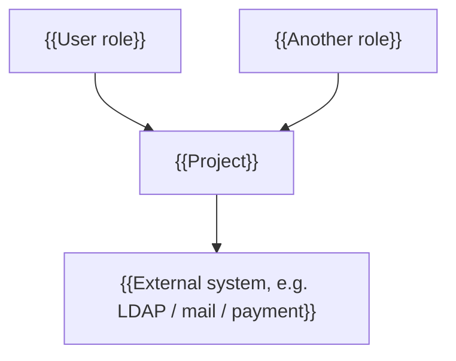
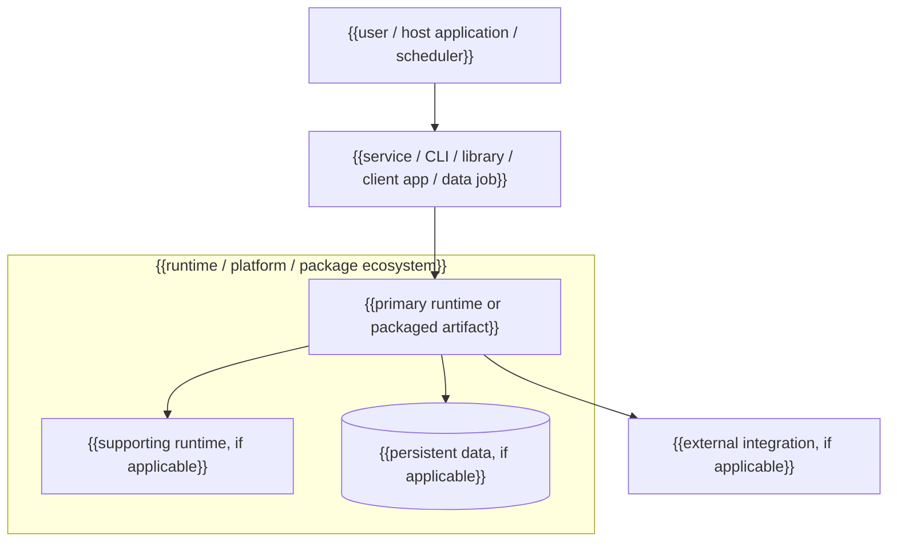

<!-- Template for docs/architecture.md (architecture-lite). Keep the two baseline views:
     context and runtime/package topology. Delete N/A nodes; do not invent infrastructure
     to fill the template. Additional views are optional and must state purpose + update
     trigger. Runtime units, consumer boundaries, and integrations follow same-change. -->

# Architecture — {{project}}

## Context

Who uses the system and what it talks to.



{{One paragraph: the system in one breath — what it is, for whom, what it depends on.}}

## Runtime / package topology

Show the applicable execution and release boundaries: deployable units for a service;
host, artifact, and consumer for a library or CLI; platform and backend boundaries for
a client application; execution units and data flow for a data job.



{{One line per shown unit or boundary: responsibility, protocol or packaging relation,
and lifecycle/scaling constraint if any. Remove every non-applicable placeholder.}}

## Additional view — {{name}} (optional)

**Purpose:** {{critical trust boundary / sequence / data lifecycle / failure path /
migration decision that the baseline views cannot show clearly}}

**Update trigger:** {{event that requires this view to change or be deleted}}

```mermaid
{{small decision-bearing diagram}}
```

<!-- Delete this entire section when no additional view earns its maintenance cost.
     Do not add routine component diagrams. -->
