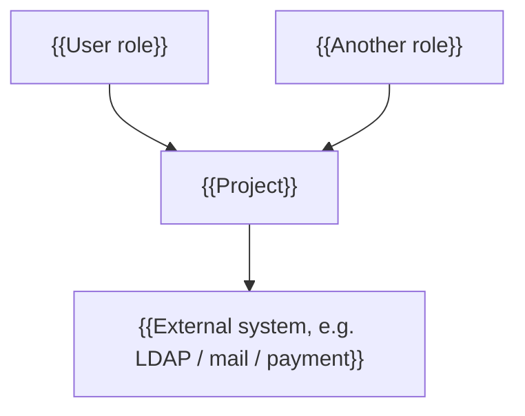
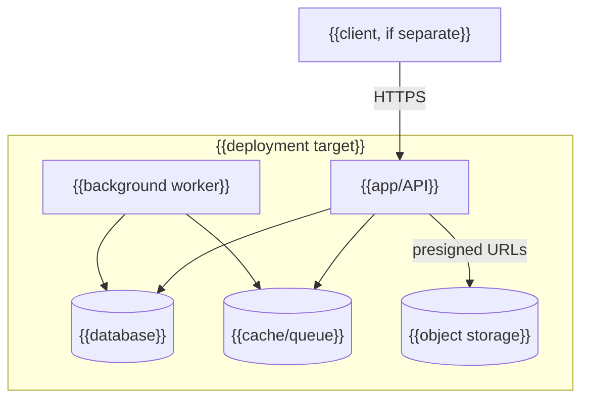

<!-- Template for docs/architecture.md (C4-lite). Exactly two diagrams — context and
     containers. No component-level diagrams: they rot. Falls under the same-change
     rule: a new container or integration updates this file in the same commit. -->

# Architecture — {{project}}

## Context

Who uses the system and what it talks to.

{{One paragraph: the system in one breath — what it is, for whom, what it depends on.}}

## Containers

Deployable units and the protocols between them.

{{One line per container: responsibility, scaling constraint if any (e.g. "scheduler —
single instance, must never run twice").}}
